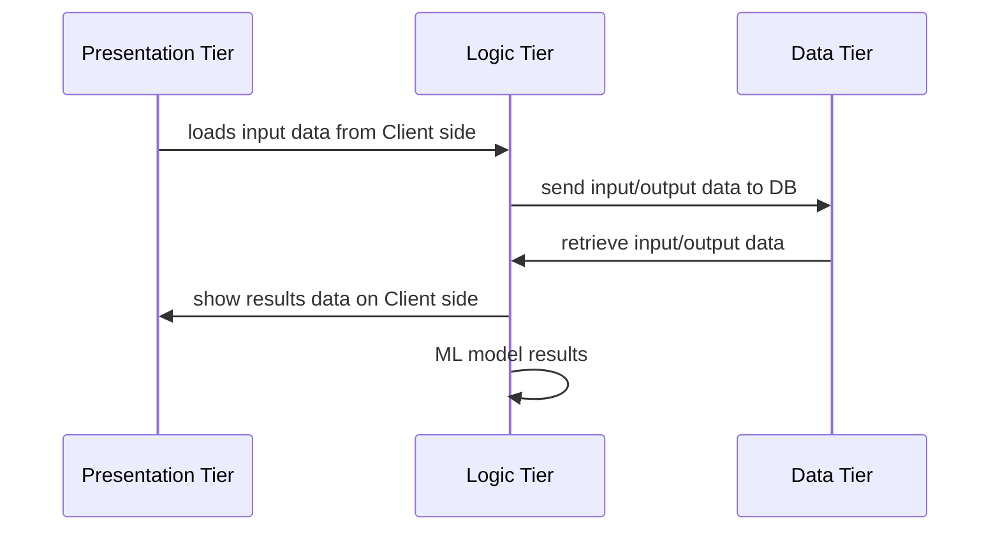

# Architecture

Simple flow chart to deploy a ML Model into production on any
public cloud

```mermaid
sequenceDiagram
    participant Presentation Tier
    participant Logic Tier
    participant Data Tier
    Presentation Tier->>Logic Tier: loads input data from Client side
    Logic Tier->>Data Tier: send input/output data to DB
    Data Tier->>Logic Tier: retrieve input/output data
    Logic Tier->>Presentation Tier: show results data on Client side
    Logic Tier->>Logic Tier: ML model results

```
